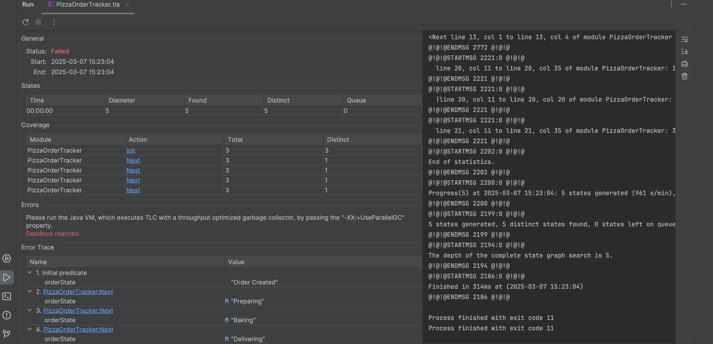
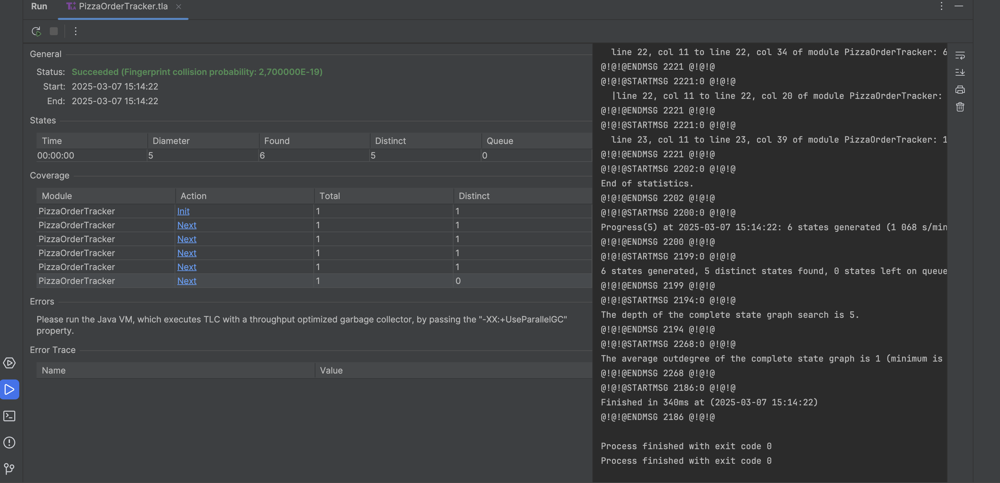

Работу выполнили студенты
```
Ушаков Александр,
Добронравов Алексей,
Майстренко Дмитрий
группа 5130904/10103,
```

# Описание выбранной foundation model
foundation model - это базовая модель, используемая для инициализации большого количества задач. Она может быть использована для многих задач, таких как генерация текста, машинное обучение, компьютерное зрение, обработка естественного языка, а также для создания других моделей.

DeepSeek — это семейство языковых и кодовых моделей, созданное компанией DeepSeek AI. DeepSeek — это трансформерная модель, которая была обучена на больших объемах текстовых и кодовых данных и может генерировать текст и программный код, близкие к созданным человеком. DeepSeek может быть использована для генерации текста, программирования, машинного перевода, кода, а также для других задач, связанных с обработкой естественного языка и искусственным интеллектом.

### Архитектура трансформера
Состоит из слоев энкодера и декодера (в GPT используется только декодер).
Включает механизмы само-внимания (Self-Attention), позволяющие модели учитывать контекст всей строки при генерации ответа.

### Обучение
Модель обучена на огромных объемах текстовых данных, включая книги, статьи, веб-сайты и другие источники.
- Предварительное обучение (Pre-training): Модель учится предсказывать следующее слово в предложении.
- Дополнительная настройка (Fine-tuning): С использованием RLHF (обучение с подкреплением с участием человека) для улучшения качества ответов.

### Параметры
Точное количество параметров не раскрывается, но предполагается, что GPT-4 значительно больше GPT-3 (который имел 175 миллиардов параметров).
Большее количество параметров позволяет модели лучше понимать сложные запросы и контекст.

# Описание простой системы управления заказом пиццы
## Общее описание системы
Система управления заказом пиццы моделирует жизненный цикл заказа от момента его размещения до завершения. Система позволяет отслеживать переходы между ключевыми этапами обработки заказа.

## Основные компоненты системы
### Модуль заказа пиццы
- Прием нового заказа.
- Перевод заказа в начальное состояние "Placed".

### Модуль обработки заказа
- Переход заказа в состояние "Preparing" после размещения.
- Подготовка ингредиентов и начало приготовления пиццы.

### Модуль приготовления пиццы
- Состояние "Baking": пицца находится в процессе выпекания.
- После завершения выпекания заказ переходит к доставке.

### Модуль доставки:
- Переход в состояние "Delivering", когда курьер забирает пиццу.
- Оповещение клиента о выезде курьера.

### Завершение заказа:
- Переход заказа в состояние "Completed", когда пицца доставлена клиенту.
- Возможность сразу начать новый заказ из завершенного состояния.

## Основные состояния заказа
| Состояние  | Описание                                                |
|------------|---------------------------------------------------------|
| Created    | Заказ создан, ожидание начала подготовки.               |
| Preparing  | Подготовка ингредиентов, начало процесса приготовления. |
| Baking     | Пицца в печи, заказ готовится к доставке.               |
| Delivering | Курьер в пути, пицца доставляется клиенту.              |
| Completed  | Заказ завершен, пицца доставлена. Возможен новый заказ. |

## Переходы между состояниями
### Размещение заказа (PlaceOrder)
- Состояние переходит из "Completed" в "Placed".
- Поддерживает возможность оформить новый заказ после завершения предыдущего.

### Подготовка пиццы (PreparePizza)
- Переход из "Placed" в "Preparing".
- Начинается сбор ингредиентов и подготовка к выпеканию.

### Выпекание пиццы (BakePizza)
- Переход из "Preparing" в "Baking".
- Пицца готовится в печи.

### Доставка пиццы (DeliverPizza)
- Переход из "Baking" в "Delivering".
- Пицца передана курьеру для доставки.

### Завершение заказа (CompleteOrder)
- Переход из "Delivering" в "Completed".
- Система готова принять новый заказ.

## Контроль за корректностью переходов (инварианты)
### Инвариант допустимых состояний
```
Invariant1 == orderState \in OrderStates
```
- Гарантирует, что система всегда находится в одном из допустимых состояний.

### Инвариант исключения нелогичных переходов
```
Invariant2 == ~(orderState = "Completed" /\ orderState = "Preparing")
```
- Предотвращает ситуацию, когда система одновременно находится в состояниях "Completed" и "Preparing".

### Запросы к foundation model
После того как мы уверенно определились с темой - начинаем работу над качественными запросами к foundation model.
Для начала дадим ему описание ожидаемой системы:
```
Hey man! I would like to create a description of a pizza order tracking system. Could you use TLA+ to model it?
Pizza Order Tracker
Description: Model a simple pizza order system.
States: Order Placed, Preparing, Baking, Delivering, Completed.
Actions: Transition between states based on order progress.
Invariants: Cannot be Delivered before Baked.
```
Запросы будем формировать на английском языке поскольку этот язык является native для foundation model.
Получаем следующий ответ от DeepSeek:
```tla+
----------------------------- MODULE PizzaOrderTracker -----------------------------
EXTENDS Naturals, Sequences

VARIABLES orderState

(* Define the possible states of the order *)
States == {"Order Created", "Preparing", "Baking", "Delivering", "Completed"}

(* Define the initial state *)
Init == orderState = "Order Created"

(* Define the possible transitions *)
Next ==
    \/ /\ orderState = "Order Created"
       /\ orderState' = "Preparing"
    \/ /\ orderState = "Preparing"
       /\ orderState' = "Baking"
    \/ /\ orderState = "Baking"
       /\ orderState' = "Delivering"
    \/ /\ orderState = "Delivering"
       /\ orderState' = "Completed"

(* Define the invariant: Cannot be Delivered before Baked *)
Invariant == 
    orderState = "Delivering" => orderState \in {"Baking", "Delivering", "Completed"}

(* Define the temporal specification *)
Spec == Init /\ [][Next]_orderState /\ WF_orderState(Next)

=============================================================================
```
Запускаем и видим ошибку:


Со второго раза DeepSeek исправил ошибку, введя новый переход:
```
\/ /\ orderState = "Completed"
   /\ orderState' = "Order Created"
```

```tla+
----------------------------- MODULE PizzaOrderTracker -----------------------------
EXTENDS Naturals, Sequences

VARIABLES orderState

(* Define the possible states of the order *)
States == {"Order Created", "Preparing", "Baking", "Delivering", "Completed"}

(* Define the initial state *)
Init == orderState = "Order Created"

(* Define the possible transitions *)
Next ==
    \/ /\ orderState = "Order Created"
       /\ orderState' = "Preparing"
    \/ /\ orderState = "Preparing"
       /\ orderState' = "Baking"
    \/ /\ orderState = "Baking"
       /\ orderState' = "Delivering"
    \/ /\ orderState = "Delivering"
       /\ orderState' = "Completed"

(* Define the invariant: Cannot be Delivered before Baked *)
Invariant == 
    orderState = "Delivering" => orderState \in {"Baking", "Delivering", "Completed"}

(* Define the temporal specification *)
Spec == Init /\ [][Next]_orderState /\ WF_orderState(Next)

=============================================================================
```
Полученный ответ выглядит довольно убедительно, необходимо проверить работоспособность кода.
Запустим симуляцию нашей системы в Intellij Idea с помощью расширения TLA+:


Видим что моделирование прошло успешно, не возникло никаких ошибок по типу Deadlock или нарушения инвариантов.
### Заключение
Получается, что модель смогла сгенерировать правильное описание системы на языке TLA+ с первого раза. Результат был ожидаем, поскольку запрос был поставлен довольно четко, плюс к тому же задача является довольно простой.

# Описание сложной системы управления заказами пиццы
